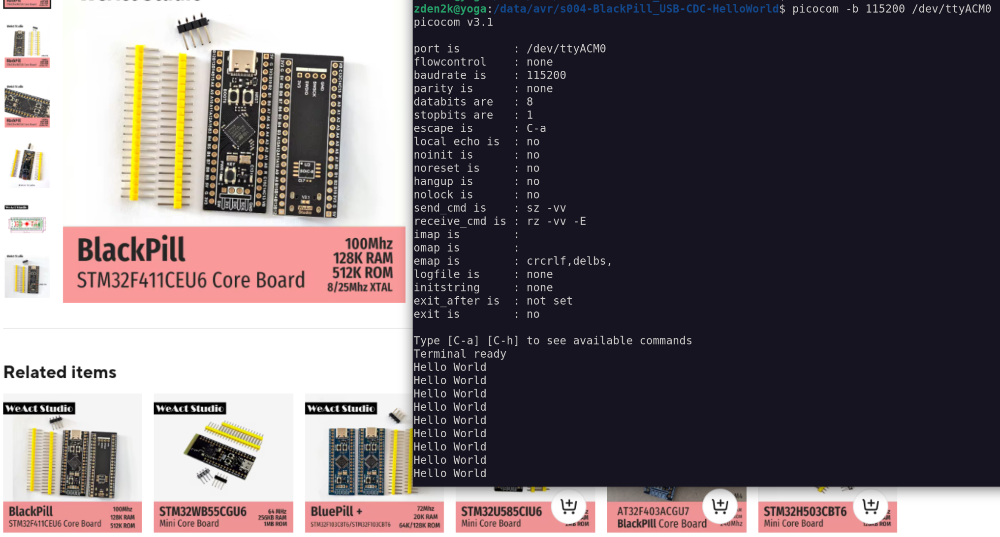

# STM32F411 Hello World USB Serial Example
A simple example of writing "Hello World" to a serial output for WA BlackPill STM32F411CEU6. Making use of the Virtual Com Device. Original Source [can be found here](https://www.bennettnotes.com/notes/stm32-blackpill-with-stmcubeide-usb-serial/)

